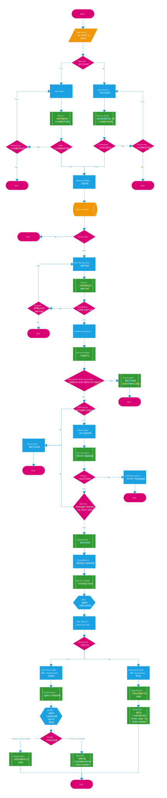

= Frently Webapp Documentation

== Project idea
In this project we are creating a webapp which enables users to lend and borrow
items of other users. The name of the webapp is Frently (fRENTly, frently or
fRently).

== Features

==== Login
When visiting the website users first have to either register themselves or
login using a username and password. Without valid credentials a user cannot
use the webapp. Currently it is assumed, that the ProPay account uses the same
e-mail as the Frently user account.

=== Spring Security
Our API routes are secured with spring security using a JSON Web Token (JWT).
When the client logs into the application he receives a bearer token, now he has
to add the token to the authorisation header of all requests. This part is
handled by the javascript application which stores the token inside our redux
store and automatically sets it bevor calling the API. +
In the backend two filters handle the authorisation and authentication process.
The authorisation filter filters all requests and validates the existance and
validity of the token inside the request header and thus alows the request to
reach the destined controller. If the token is not valid the backend returns 403
 HTTP error. A token is valid for ten days. + 
The authentication filter is used to issue the token to a user that wants to
login to the application, by validating username and password.

=== Borrowing Items
Users can borrow items by simply specifying a start- and enddate. Sending an
inquiry adds a reservation for the requested time. Then the person lending the
item can either accept or decline the request. Upon confirmation, the article/
item and a deposit are blocked for the time span. Returning the item triggers
the release of the safety deposit and the transaction of the lending cost via
ProPay.

=== Lending Items
In addition to borrowing items, users can also put their own items up for
renting. The required information is a name, a description, a safety deposit, a
daily renting rate and a location where the item can be picked up.

==== Accepting/Declining Inquiries
When users want to borrow an item, the owner can either accept or decline the
request. When an inquiry is declined, the item will be listed as available for
the inquiry period. Otherwise a transaction, which is comparable with a
contract, is generated.

=== Returning Items
At any time the borrower of an item can click "Item returned".
Then the owner of the item simply can click on "Item returned" and the billing
will be done automatically.
If however an item gets returned damaged or other problems exist with the
returned item, the owner can simply click "Problem with item".
After that the transaction will be sent to the conflict center, and the Frently
support staff will try to find a solution with the owner and the person who
rented the item.
When a solution is reached, the support staff will either release the depsoit or
punish the borrower by transfering the depsit to the lender. This can only be
inside the webapp by the admin.

== Structure
Our project uses Spring Boot Java for the backend, a MySQL database and React
and Redux for the frontend.
The webapp is designed as a single page webapp. All interactions between the
frontend and backend are done using a REST API.
We settled for this since it's a more perfomant, elegant and more modern
solution to create webapps and services.
Billing services are provided by ProPay's REST-API.

=== Deployment structure
For easy shipping and deployment we settled for a docker-compose using multiple
docker images:

  * We use a nginx container as a reverse proxy. It maps "/" to the "frentlyfrontend" frontend container and
    /api to the "frentlyapi" backend container.
  * The "frentlydb" database container hosts a mysql database
    and is linked to the "frentlyapi" backend container.
  * The "propay" backend container hosts the ProPay app and is linked to the "frentlyapi" backend container.
  * The "frentlyapi" backend container starts the spring-boot app with the jar-file from the application and
    waits with the wait-for-it script for the "frentlydb" database container to start.
  * The "frentlyfrontend" frontend container delivers the react frontend with nginx.

//Backend structure documentation
include::backend/structure.adoc[]

//Frontend structure documentation
include::frontend/structure.adoc[]

//Interface structure documentation
include::interface/structure.adoc[]

== Workflows
In this section, common user operations are being defined/explained using flowcharts.

==== Logging in / getting authorized

==== Rent an item/article

=== Buy an item/article

=== Upload/list an item for rent or sale

== Problems / Issues
=== Deployment / Docker Issues
We had problems with the /api mapping to the "frentlyapi" backend container
caused by spring-security component
and nginx domain.conf. Nginx maps to /api to a spring-boot app without adding
the /api in the spring-boot app, if a "/"
is added to the proxy_pass url in the domain.conf. But that results in a error
in spring security because it produces a url with a
"//" and that is by default not allowed in spring security. The solution was to
tell nginx to remove the /api. We used the solution provided by
https://github.com/bendisposto-propra[Jens Bendisposto] in
https://github.com/hhu-propra2/abschlussprojekt-illegalskillsexception/issues1[Issue #1].

=== Timeout / Retry Issues
There were problems using the spring-boot retry package for timeouts and
retries. We use our own exceptions to let the frontend know
that there is a problem. In this case every time the ProPay API does not
respond after multiple retries the methods in our ProPayService
should throw a "ProPayConnectionException", but with the spring-boot retry
package a "RetriesExhaustedException" is thrown that wraps our
exception. Our solution is, that we intercept the thown "RetriesExhaustedException"
in all called ProPayService methods and throw a "ProPayConnectionException" instead.
